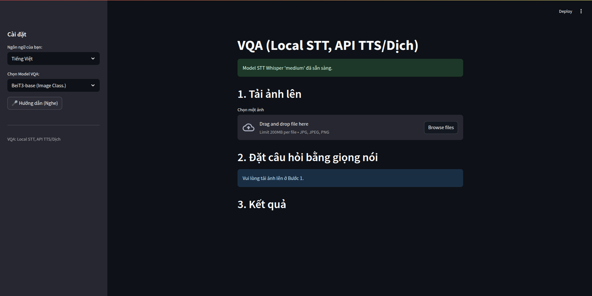

# Object - based visual question answering tools

## Install
```
pip install -r requirements.txt
```

### Resources
| Link            |
| ------------------ |
| [Our annotation data](https://www.kaggle.com/datasets/phong2004/final-vqa-dataset) |
| [Our images dataset](https://www.kaggle.com/datasets/ppdddd/vqa-dataset) |
| [Checkpoints](https://www.kaggle.com/models/phong2004/beit-3-finetune-custom-vqa) |


## Running
```
streamlit run app.py
```

## Finetuning
### ViLT
```
python train_vilt.py --checkpoint_path /path/to/checkpoint --finetune name_of_vilt_model --epochs 10 --num_workers 1 --batch_size 16
```
### BEiT-3
```
cd beit3
python -m venv venv
source venv/bin/activate
pip install -r requirements.txt
./train.sh
```